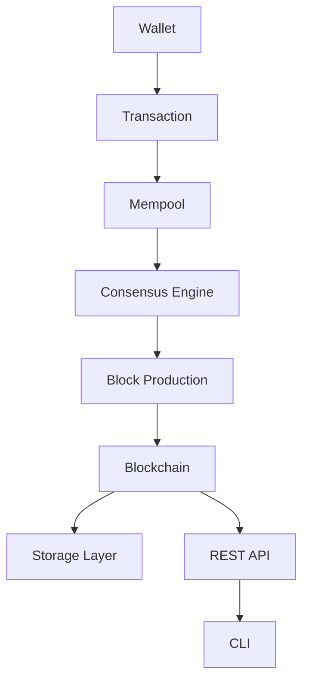
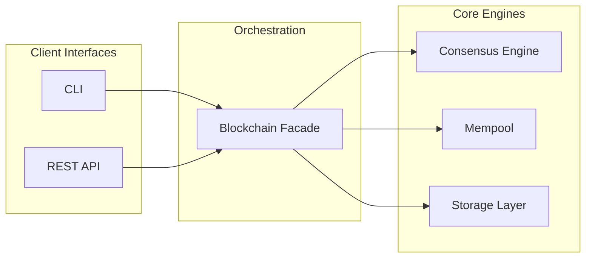

# SAYANJALI BLOCKCHAIN

**SAYANJALI BLOCKCHAIN** is an independent Layer-1 blockchain implementation
and the native settlement layer for the **SYJ Token**. It is developed and
maintained by **SAYANJALI NEXUS PRIVATE LIMITED** as open, modular
infrastructure — not a token contract deployed on an existing chain, but a
purpose-built chain with its own block format, consensus engine, wallet
system, and node software.

This repository contains the current MVP release: a complete, tested
reference implementation of the chain's core primitives, structured so that
networking, alternative consensus mechanisms, and a smart contract runtime
can be added as independent modules in subsequent phases.

---

## Table of Contents

- [Project Overview](#project-overview)
- [Core Principles](#core-principles)
- [Features](#features)
- [Architecture](#architecture)
- [Repository Structure](#repository-structure)
- [Technology Stack](#technology-stack)
- [Installation](#installation)
- [Quick Start](#quick-start)
- [Running the Node](#running-the-node)
- [API Documentation](#api-documentation)
- [CLI Commands](#cli-commands)
- [Configuration](#configuration)
- [Testing](#testing)
- [Security](#security)
- [Roadmap](#roadmap)
- [Contributing](#contributing)
- [License](#license)
- [Disclaimer](#disclaimer)
- [Project Vision & Architecture](#project-vision--architecture)

---

## Project Overview

Distributed ledgers built directly on top of general-purpose smart contract
platforms inherit those platforms' constraints — fee markets, execution
limits, and governance they do not control. SAYANJALI BLOCKCHAIN exists to
give the SAYANJALI NEXUS ecosystem and the SYJ Token a chain of their own:
one where consensus rules, economic parameters, and the upgrade path are
defined by the protocol itself rather than inherited from a host network.

The long-term objective is a production-grade Layer-1 network supporting
native transfers, staking, smart contract execution, and interoperability
with external chains. The current release is the foundation that objective
is built on: a correctly implemented block model, a working Proof-of-Work
consensus engine, cryptographically signed transactions, persistent
storage, and both a REST API and a command-line interface for operating a
node.

Every architectural decision in this MVP is made with that trajectory in
mind — consensus is defined behind an interface rather than hard-coded,
storage is accessed through an abstraction rather than a specific database
driver, and the API and CLI are both thin clients over one authoritative
chain implementation.

## Core Principles

| Principle | Description |
|---|---|
| **Security** | Signature verification, hash-chained blocks, and header-authenticated difficulty on every block. |
| **Transparency** | Deterministic, auditable state transitions with a fully open, dependency-minimal codebase. |
| **Scalability** | Header-only block hashing and a storage layer that scales from SQLite to PostgreSQL without code changes. |
| **Modularity** | Consensus, storage, validation, and networking are isolated behind clear interfaces. |
| **Extensibility** | New consensus algorithms, transaction types, and node capabilities can be added without modifying core modules. |
| **Performance** | Lightweight block headers and indexed persistence keep validation and mining costs predictable. |
| **Open Architecture** | No proprietary formats. Standard cryptographic primitives (SHA-256, ECDSA/SECP256k1) throughout. |

## Features

| Category | Capability | Status |
|---|---|---|
| Blockchain Core | Genesis block, block hashing, Merkle-root transaction integrity | Implemented |
| Blockchain Core | Full chain validation from genesis to tip | Implemented |
| Consensus | Proof-of-Work mining with configurable, per-block difficulty | Implemented |
| Consensus | Header-authenticated difficulty (tamper-evident) | Implemented |
| Wallet System | ECDSA (SECP256k1) key generation and address derivation | Implemented |
| Wallet System | Address format validation and balance lookup | Implemented |
| Transaction Engine | Digitally signed, independently verifiable transactions | Implemented |
| Transaction Engine | Mempool with duplicate and signature validation | Implemented |
| Validation | Block, chain, and transaction-level validation rules | Implemented |
| Persistent Storage | SQLAlchemy-backed storage, SQLite by default | Implemented |
| REST API | FastAPI node interface with OpenAPI documentation | Implemented |
| CLI | Typer-based command-line node operations | Implemented |
| Configuration | Centralized, environment-variable-driven settings | Implemented |
| Testing | Automated test suite (37 tests) across all modules | Implemented |
| Networking | Peer-to-peer block and transaction propagation | Planned |
| Consensus | Proof-of-Stake / Delegated Proof-of-Stake | Planned |
| Execution | Smart contract runtime | Planned |

## Architecture

SAYANJALI BLOCKCHAIN separates concerns into four layers: client interfaces
(API and CLI), the chain orchestrator, the pluggable core engines
(consensus, mempool, storage), and the underlying data model (blocks and
transactions).





### Design Decisions

**Pluggable consensus.** The consensus layer is defined behind an abstract
`ConsensusEngine` interface. Proof of Work is the reference implementation;
Proof of Stake and Delegated Proof of Stake can be introduced as additional
implementations without modifying the orchestrator or any client-facing
code.

**Storage abstraction.** Persistence is implemented on SQLAlchemy Core
rather than a database-specific driver. The default backend is SQLite;
migrating to PostgreSQL is a configuration change, not a code change.

**Header-only block hashing.** A block's hash is computed from its header
fields — index, previous hash, timestamp, nonce, difficulty, and Merkle
root — rather than its full transaction payload. This keeps proof-of-work
cost independent of block size while the Merkle root still guarantees
transaction-level integrity.

**Per-block difficulty recording.** Each block records the difficulty it
was mined at, and that value is covered by the block's own hash. This
permits legitimate difficulty retargeting over time without invalidating
previously accepted blocks.

**Single source of truth.** Both the REST API and the CLI operate through
one `Blockchain` facade. There is exactly one implementation of chain
logic; client interfaces do not duplicate business rules.

## Repository Structure

```
sayanjali-blockchain/
├── blockchain/
│   ├── block.py          # Block model, hashing, Merkle root, genesis block
│   ├── blockchain.py     # Orchestrator: chain state, mining, validation
│   ├── consensus.py      # Consensus interface and Proof-of-Work engine
│   ├── mempool.py        # Pending transaction pool
│   ├── mining.py         # Block assembly and coinbase issuance
│   ├── storage.py        # SQLAlchemy-backed persistence layer
│   ├── transaction.py    # Transaction model, signing, verification
│   ├── utils.py          # Hashing, logging, shared exception types
│   ├── validators.py     # Block, chain, and transaction validation rules
│   └── wallet.py         # Key generation, address derivation, signing
├── api/
│   ├── main.py            # FastAPI application entrypoint
│   ├── routes.py          # REST endpoint definitions
│   └── schemas.py         # Request and response models
├── cli/
│   └── main.py             # Command-line interface
├── config/
│   └── settings.py         # Centralized, environment-driven configuration
├── database/                # Persisted chain data (excluded from version control)
├── logs/                     # Structured log output (excluded from version control)
├── tests/                    # Automated test suite
├── requirements.txt
├── README.md
├── LICENSE
└── .gitignore
```

Each top-level directory corresponds to a single architectural
responsibility: `blockchain/` owns chain logic and has no dependency on
`api/` or `cli/`; `api/` and `cli/` are both consumers of `blockchain/` and
never communicate with each other directly; `config/` is the single source
of runtime parameters read by every other package.

## Technology Stack

| Layer | Technology |
|---|---|
| Language | Python 3.13+ |
| API Framework | FastAPI, Uvicorn |
| Data Validation | Pydantic |
| Persistence | SQLAlchemy Core, SQLite (PostgreSQL-compatible) |
| CLI Framework | Typer, Rich |
| Cryptography | `cryptography`, `ecdsa` (SECP256k1) |
| Testing | pytest, FastAPI `TestClient` |
| Configuration | Environment-variable-driven dataclasses |

## Installation

SAYANJALI BLOCKCHAIN runs on Linux, Windows, macOS, and Android (via
Termux) with no platform-specific code paths.

### Prerequisites

- Python 3.13 or later
- `pip`
- `git`

### Linux / macOS

```bash
git clone https://github.com/<your-username>/sayanjali-blockchain.git
cd sayanjali-blockchain
python3 -m venv venv
source venv/bin/activate
pip install -r requirements.txt
```

### Windows

```powershell
git clone https://github.com/<your-username>/sayanjali-blockchain.git
cd sayanjali-blockchain
python -m venv venv
venv\Scripts\activate
pip install -r requirements.txt
```

<details>
<summary>Android (Termux)</summary>

```bash
pkg update -y && pkg upgrade -y
pkg install -y git python clang openssl-tool rust binutils

git clone https://github.com/<your-username>/sayanjali-blockchain.git
cd sayanjali-blockchain

python -m venv venv
source venv/bin/activate
pip install --upgrade pip
pip install -r requirements.txt
```

If `cryptography` fails to build a wheel, force a source build:

```bash
pip install cryptography --no-binary :all:
```

</details>

## Quick Start

```bash
source venv/bin/activate   # Windows: venv\Scripts\activate

python -m cli.main create-wallet
python -m cli.main mine <address-from-above>
python -m cli.main status
python -m cli.main validate
```

Equivalent flow through the REST API:

```bash
python -m api.main &

curl -s -X POST http://127.0.0.1:8000/wallet/create
curl -s -X POST http://127.0.0.1:8000/mine \
  -H "Content-Type: application/json" \
  -d '{"miner_address": "<address-from-above>"}'
curl -s http://127.0.0.1:8000/status
```

## Running the Node

The node process exposes chain state and mining functionality over HTTP.

```bash
python -m api.main
# or, equivalently:
uvicorn api.main:app --host 0.0.0.0 --port 8000
```

Once running, interactive API documentation is available at:

- Swagger UI: `http://127.0.0.1:8000/docs`
- ReDoc: `http://127.0.0.1:8000/redoc`

The CLI can operate against the same underlying chain state independently
of whether the API process is running, since both share the same storage
layer.

## API Documentation

| Method | Endpoint | Description |
|---|---|---|
| GET | `/health` | Liveness probe |
| GET | `/status` | Node and chain status summary |
| GET | `/chain` | Full blockchain |
| GET | `/block/{index}` | Retrieve a single block by index |
| POST | `/wallet/create` | Generate a new wallet |
| GET | `/wallet/{address}` | Retrieve confirmed balance for an address |
| POST | `/transaction/create` | Construct an unsigned transaction envelope |
| POST | `/transaction/sign` | Sign a transaction with a private key |
| POST | `/transaction/submit` | Submit a signed transaction to the mempool |
| GET | `/transactions/pending` | List pending mempool transactions |
| POST | `/mine` | Mine a new block and credit the reward to a miner address |

Full request and response schemas are generated automatically and are
available at `/docs` and `/redoc` on a running node.

## CLI Commands

| Command | Description |
|---|---|
| `create-wallet` | Generate a new wallet and display its keys and address |
| `show-chain` | Display a summary of every block in the chain |
| `mine <address>` | Mine a new block, crediting the reward to `<address>` |
| `status` | Display current node and chain status |
| `create-transaction` | Construct, sign, and submit a transaction interactively |
| `validate` | Validate the entire chain from genesis to tip |
| `start-node` | Start the REST API node via Uvicorn |

## Configuration

All runtime parameters are centralized in `config/settings.py` and can be
overridden via environment variables.

| Parameter | Environment Variable | Default | Description |
|---|---|---|---|
| Mining difficulty | `SYJ_DIFFICULTY` | `4` | Proof-of-Work difficulty target |
| Target block time | `SYJ_TARGET_BLOCK_TIME` | `30` | Seconds, used for difficulty retargeting |
| Difficulty adjustment interval | `SYJ_DIFFICULTY_ADJUSTMENT_INTERVAL` | `10` | Blocks between retarget evaluations |
| Block reward | `SYJ_BLOCK_REWARD` | `50.0` | Coinbase reward per mined block |
| Network name | `SYJ_NETWORK_NAME` | `sayanjali-mainnet-mvp` | Logical network identifier |
| Host | `SYJ_HOST` | `0.0.0.0` | REST API bind address |
| Port | `SYJ_PORT` | `8000` | REST API bind port |
| Chain ID | `SYJ_CHAIN_ID` | `1` | Numeric network identifier |
| Database file | `SYJ_DB_FILE` | `sayanjali_chain.db` | SQLite filename under `database/` |
| Log level | `SYJ_LOG_LEVEL` | `INFO` | Logging verbosity |

Genesis parameters (fixed timestamp, initial hash, and network message) are
defined in `GenesisConfig` and are intentionally not environment-overridable,
so that every unmodified clone of the repository produces an identical
genesis block.

## Testing

```bash
pytest -v
```

The test suite contains 37 tests covering wallets, transactions, blocks,
mining, consensus, chain validation, and the complete REST API surface via
FastAPI's `TestClient`. Every test runs against an isolated, temporary
SQLite database, so the test suite never modifies a developer's local chain
state.

```bash
pip install pytest-cov
pytest --cov=blockchain --cov=api --cov-report=term-missing
```

## Security

**Cryptography.** Wallets use ECDSA on the SECP256k1 curve, the same curve
used by Bitcoin and Ethereum, via the `ecdsa` and `cryptography` libraries.
Addresses are one-way SHA-256 derivations of the public key.

**Hashing.** Block and transaction integrity is enforced with SHA-256.
Block headers include the Merkle root of all included transactions, and a
block's difficulty is itself part of the hashed header, preventing
independent tampering with either field.

**Digital signatures.** Every non-coinbase transaction must be signed by
the sender's private key and is independently verified against the
sender's public key before acceptance into the mempool or a block.

**Validation.** Every block is validated against its predecessor
(sequential index, correct previous-hash linkage, monotonic timestamp,
proof-of-work satisfaction) before being appended to the chain, and the
entire chain can be re-validated from genesis at any time via `validate`.

**Known limitations in the current release:**

- No peer-to-peer networking; each node is authoritative over its own
  local chain state.
- The `/transaction/sign` endpoint accepts a private key over HTTP and is
  intended for single-operator development use only. It must not be
  exposed on a shared or public-facing deployment.
- Difficulty retargeting uses a conservative, bounded adjustment rather
  than a full ratio-based algorithm.
- The REST API has no built-in authentication, rate limiting, or TLS
  termination, and CORS is permissive by default.

**Future security roadmap** includes peer authentication for networking,
client-side transaction signing (removing private key transmission
entirely), a full difficulty retargeting algorithm, and a formal security
audit ahead of any mainnet deployment.

Vulnerabilities should be reported privately rather than through public
issues, given the project's early stage.

## Roadmap

| Phase | Scope | Status |
|---|---|---|
| 1 | Blockchain core: blocks, hashing, genesis | Complete |
| 2 | Wallet system | Complete |
| 3 | Transaction engine | Complete |
| 4 | Proof-of-Work consensus and mining | Complete |
| 5 | REST API, CLI, persistent storage | Complete |
| 6 | Peer-to-peer networking and multi-node synchronization | Planned |
| 7 | Full difficulty retargeting; Proof-of-Stake groundwork | Planned |
| 8 | Block explorer | Planned |
| 9 | Smart contract execution environment | Planned |
| 10 | Governance mechanisms and SDK | Planned |
| 11 | Mainnet architecture and SYJ Token launch | Planned |

The current architecture — pluggable consensus, an abstracted storage
layer, and a versioned API — is designed so that phases 6 through 11 are
additive extensions rather than rewrites of the existing codebase.

## Contributing

Contributions are welcome. To propose a change:

1. Fork the repository and create a feature branch.
2. Ensure the full test suite passes locally: `pytest -v`.
3. Follow the existing code conventions: complete type hints, PEP 8
   formatting, and docstrings on all public classes and functions.
4. Keep pull requests scoped to a single logical change.
5. Open a pull request with a clear description of the change and its
   motivation.

Code review focuses on correctness, test coverage, and consistency with
the architectural principles described above.

## License

Released under the [MIT License](LICENSE). The license applies to the
source code in this repository only and does not grant rights to the
SAYANJALI, SYJ Token, or SAYANJALI NEXUS names, logos, or trademarks.

## Disclaimer

This release is a Minimum Viable Product intended for research,
experimentation, and educational purposes. It has not undergone a formal
security audit and is **not** production-ready. It should not be used to
custody, transfer, or represent real economic value in its current form.

## Project Vision & Architecture

SAYANJALI BLOCKCHAIN was conceived and architected by **Syed Ali Hasan
Moosavi**, Founder & Managing Director of **SAYANJALI NEXUS PRIVATE
LIMITED**. The project vision, system architecture, blockchain design, and
technical direction originate from his work. The implementation of this
MVP was developed under his architectural leadership using AI-assisted
software engineering.

**Lead Architect & Project Vision**
Syed Ali Hasan Moosavi
