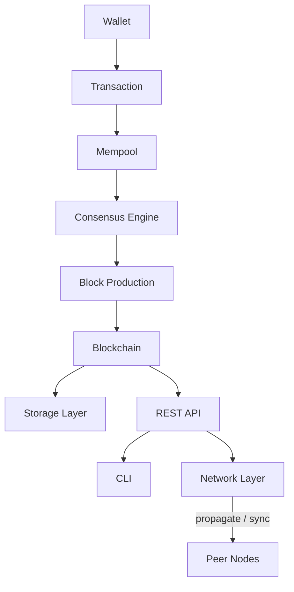
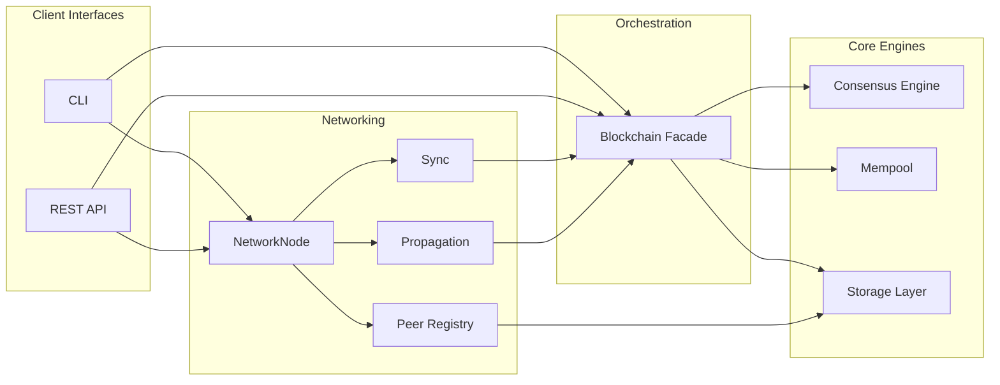

# SAYANJALI BLOCKCHAIN

**SAYANJALI BLOCKCHAIN** is an independent Layer-1 blockchain implementation
and the native settlement layer for the **SYJ Token**. It is developed and
maintained by **SAYANJALI NEXUS PRIVATE LIMITED** as open, modular
infrastructure — not a token contract deployed on an existing chain, but a
purpose-built chain with its own block format, consensus engine, wallet
system, node software, and peer-to-peer networking.

This repository contains the current release: a complete, tested reference
implementation of the chain's core primitives (Phase 1) plus HTTP-based
multi-node synchronization (Phase 2), structured so that stronger
consensus, a smart contract runtime, and further networking hardening can
continue to be added as independent modules in subsequent phases.

---

## Table of Contents

- [Project Overview](#project-overview)
- [Core Principles](#core-principles)
- [Features](#features)
- [Architecture](#architecture)
- [Repository Structure](#repository-structure)
- [Technology Stack](#technology-stack)
- [Installation](#installation)
- [Quick Start](#quick-start)
- [Running the Node](#running-the-node)
- [Networking](#networking)
- [Running a Local Multi-Node Network](#running-a-local-multi-node-network)
- [API Documentation](#api-documentation)
- [CLI Commands](#cli-commands)
- [Configuration](#configuration)
- [Testing](#testing)
- [Security](#security)
- [Roadmap](#roadmap)
- [Contributing](#contributing)
- [License](#license)
- [Disclaimer](#disclaimer)
- [Project Vision & Architecture](#project-vision--architecture)

---

## Project Overview

Distributed ledgers built directly on top of general-purpose smart contract
platforms inherit those platforms' constraints — fee markets, execution
limits, and governance they do not control. SAYANJALI BLOCKCHAIN exists to
give the SAYANJALI NEXUS ecosystem and the SYJ Token a chain of their own:
one where consensus rules, economic parameters, and the upgrade path are
defined by the protocol itself rather than inherited from a host network.

The long-term objective is a production-grade Layer-1 network supporting
native transfers, staking, smart contract execution, and interoperability
with external chains. The current release is the foundation that objective
is built on: a correctly implemented block model, a working Proof-of-Work
consensus engine, cryptographically signed transactions, persistent
storage, and both a REST API and a command-line interface for operating a
node.

Every architectural decision in this MVP is made with that trajectory in
mind — consensus is defined behind an interface rather than hard-coded,
storage is accessed through an abstraction rather than a specific database
driver, and the API and CLI are both thin clients over one authoritative
chain implementation.

## Core Principles

| Principle | Description |
|---|---|
| **Security** | Signature verification, hash-chained blocks, and header-authenticated difficulty on every block. |
| **Transparency** | Deterministic, auditable state transitions with a fully open, dependency-minimal codebase. |
| **Scalability** | Header-only block hashing and a storage layer that scales from SQLite to PostgreSQL without code changes. |
| **Modularity** | Consensus, storage, validation, and networking are isolated behind clear interfaces. |
| **Extensibility** | New consensus algorithms, transaction types, and node capabilities can be added without modifying core modules. |
| **Performance** | Lightweight block headers and indexed persistence keep validation and mining costs predictable. |
| **Open Architecture** | No proprietary formats. Standard cryptographic primitives (SHA-256, ECDSA/SECP256k1) throughout. |

## Features

| Category | Capability | Status |
|---|---|---|
| Blockchain Core | Genesis block, block hashing, Merkle-root transaction integrity | Implemented |
| Blockchain Core | Full chain validation from genesis to tip | Implemented |
| Consensus | Proof-of-Work mining with configurable, per-block difficulty | Implemented |
| Consensus | Header-authenticated difficulty (tamper-evident) | Implemented |
| Wallet System | ECDSA (SECP256k1) key generation and address derivation | Implemented |
| Wallet System | Address format validation and balance lookup | Implemented |
| Transaction Engine | Digitally signed, independently verifiable transactions | Implemented |
| Transaction Engine | Mempool with duplicate and signature validation | Implemented |
| Validation | Block, chain, and transaction-level validation rules | Implemented |
| Persistent Storage | SQLAlchemy-backed storage, SQLite by default | Implemented |
| REST API | FastAPI node interface with OpenAPI documentation | Implemented |
| CLI | Typer-based command-line node operations | Implemented |
| Configuration | Centralized, environment-variable-driven settings | Implemented |
| Networking | Peer registration, discovery, and persisted peer registry | Implemented |
| Networking | Chain synchronization by accumulated proof-of-work, with reorg support | Implemented |
| Networking | Block and transaction propagation with duplicate/invalid rejection | Implemented |
| Networking | Basic per-peer rate limiting and payload size limits | Implemented |
| Testing | Automated test suite (92 tests) across all modules | Implemented |
| Consensus | Proof-of-Stake / Delegated Proof-of-Stake | Planned |
| Networking | Gossip protocol, peer authentication, handshake negotiation | Planned |
| Execution | Smart contract runtime | Planned |

## Architecture

SAYANJALI BLOCKCHAIN separates concerns into five layers: client interfaces
(API and CLI), the networking layer (peer registry, sync, propagation), the
chain orchestrator, the pluggable core engines (consensus, mempool,
storage), and the underlying data model (blocks and transactions).





### Design Decisions

**Pluggable consensus.** The consensus layer is defined behind an abstract
`ConsensusEngine` interface. Proof of Work is the reference implementation;
Proof of Stake and Delegated Proof of Stake can be introduced as additional
implementations without modifying the orchestrator or any client-facing
code.

**Storage abstraction.** Persistence is implemented on SQLAlchemy Core
rather than a database-specific driver. The default backend is SQLite;
migrating to PostgreSQL is a configuration change, not a code change.

**Header-only block hashing.** A block's hash is computed from its header
fields — index, previous hash, timestamp, nonce, difficulty, and Merkle
root — rather than its full transaction payload. This keeps proof-of-work
cost independent of block size while the Merkle root still guarantees
transaction-level integrity.

**Per-block difficulty recording.** Each block records the difficulty it
was mined at, and that value is covered by the block's own hash. This
permits legitimate difficulty retargeting over time without invalidating
previously accepted blocks.

**Single source of truth.** Both the REST API and the CLI operate through
one `Blockchain` facade. There is exactly one implementation of chain
logic; client interfaces do not duplicate business rules.

**Work-based chain adoption.** When synchronizing with a peer, the deciding
factor is accumulated proof-of-work (`sum(16**difficulty)` across a chain
-- difficulty counts required leading *hexadecimal* zeros, so each level
narrows the valid-hash space by 16x, not 2x), not block count. A shorter
chain mined at higher difficulty can represent more real computational
effort than a longer one mined at lower difficulty; using length alone
would let a chain of many trivially-easy blocks outrank
one that was genuinely harder to produce.

**Networking calls the core, never duplicates it.** `blockchain/network/`
contains no independent validation or consensus logic. Peer-supplied blocks
and transactions are parsed back into the same `Block`/`Transaction`
objects Phase 1 defines and pushed through the same `Blockchain` methods
(`replace_chain`, `submit_transaction`) that the API and CLI already use.
A block or chain a single node would reject locally is rejected identically
whether it came from mining or from a peer.

**P2P endpoints share the node's existing HTTP surface.** Rather than run
a second listener, `/network/*` endpoints are served on the same FastAPI
application and port as the REST API. This keeps the transport a single
lightweight HTTP surface for this MVP; see `config.settings.P2PConfig` for
the `advertised_address` field that lets a node behind NAT/port-forwarding
tell peers a different externally-reachable address than the one it binds.

## Repository Structure

```
sayanjali-blockchain/
├── blockchain/
│   ├── block.py          # Block model, hashing, Merkle root, genesis block
│   ├── blockchain.py     # Orchestrator: chain state, mining, validation
│   ├── consensus.py      # Consensus interface and Proof-of-Work engine
│   ├── mempool.py        # Pending transaction pool
│   ├── mining.py         # Block assembly and coinbase issuance
│   ├── storage.py        # SQLAlchemy-backed persistence layer
│   ├── transaction.py    # Transaction model, signing, verification
│   ├── utils.py          # Hashing, logging, shared exception types
│   ├── validators.py     # Block, chain, and transaction validation rules
│   ├── wallet.py         # Key generation, address derivation, signing
│   └── network/
│       ├── node.py         # NetworkNode: identity, peers, HTTP client
│       ├── peer.py         # Peer dataclass and persisted PeerRegistry
│       ├── protocol.py     # httpx-based wire client for peer communication
│       ├── sync.py         # Chain fetch, validate, compare-work, adopt
│       ├── propagation.py  # Block/transaction broadcast and receive handling
│       └── ratelimit.py    # Basic per-peer rate limiting
├── api/
│   ├── main.py            # FastAPI application entrypoint
│   ├── routes.py          # REST endpoint definitions (Phase 1)
│   ├── network_routes.py  # P2P networking endpoints (Phase 2)
│   └── schemas.py         # Request and response models
├── cli/
│   └── main.py             # Command-line interface
├── config/
│   └── settings.py         # Centralized, environment-driven configuration
├── database/                # Persisted chain data (excluded from version control)
├── logs/                     # Structured log output (excluded from version control)
├── tests/                    # Automated test suite
├── requirements.txt
├── README.md
├── LICENSE
└── .gitignore
```

Each top-level directory corresponds to a single architectural
responsibility: `blockchain/` owns chain and networking logic and has no
dependency on `api/` or `cli/`; `api/` and `cli/` are both consumers of
`blockchain/` and never communicate with each other directly; `config/` is
the single source of runtime parameters read by every other package.

## Technology Stack

| Layer | Technology |
|---|---|
| Language | Python 3.13+ |
| API Framework | FastAPI, Uvicorn |
| Data Validation | Pydantic |
| Persistence | SQLAlchemy Core, SQLite (PostgreSQL-compatible) |
| CLI Framework | Typer, Rich |
| Cryptography | `cryptography`, `ecdsa` (SECP256k1) |
| Testing | pytest, FastAPI `TestClient` |
| Configuration | Environment-variable-driven dataclasses |

## Installation

SAYANJALI BLOCKCHAIN runs on Linux, Windows, macOS, and Android (via
Termux) with no platform-specific code paths.

### Prerequisites

- Python 3.13 or later
- `pip`
- `git`

### Linux / macOS

```bash
git clone https://github.com/<your-username>/sayanjali-blockchain.git
cd sayanjali-blockchain
python3 -m venv venv
source venv/bin/activate
pip install -r requirements.txt
```

### Windows

```powershell
git clone https://github.com/<your-username>/sayanjali-blockchain.git
cd sayanjali-blockchain
python -m venv venv
venv\Scripts\activate
pip install -r requirements.txt
```

<details>
<summary>Android (Termux)</summary>

```bash
pkg update -y && pkg upgrade -y
pkg install -y git python clang openssl-tool rust binutils

git clone https://github.com/<your-username>/sayanjali-blockchain.git
cd sayanjali-blockchain

python -m venv venv
source venv/bin/activate
pip install --upgrade pip
pip install -r requirements.txt
```

If `cryptography` fails to build a wheel, force a source build:

```bash
pip install cryptography --no-binary :all:
```

</details>

## Quick Start

```bash
source venv/bin/activate   # Windows: venv\Scripts\activate

python -m cli.main create-wallet
python -m cli.main mine <address-from-above>
python -m cli.main status
python -m cli.main validate
```

Equivalent flow through the REST API:

```bash
python -m api.main &

curl -s -X POST http://127.0.0.1:8000/wallet/create
curl -s -X POST http://127.0.0.1:8000/mine \
  -H "Content-Type: application/json" \
  -d '{"miner_address": "<address-from-above>"}'
curl -s http://127.0.0.1:8000/status
```

## Running the Node

The node process exposes chain state and mining functionality over HTTP.

```bash
python -m api.main
# or, equivalently:
uvicorn api.main:app --host 0.0.0.0 --port 8000
```

Once running, interactive API documentation is available at:

- Swagger UI: `http://127.0.0.1:8000/docs`
- ReDoc: `http://127.0.0.1:8000/redoc`

The CLI can operate against the same underlying chain state independently
of whether the API process is running, since both share the same storage
layer.

## Networking

Every running node also serves a peer-to-peer networking surface under
`/network/*`, on the same host and port as the REST API. A node's identity
(`node_id`) is generated once and persisted, so it survives restarts. Peers
are registered by address (`http://host:port`), persisted the same way, and
exchanged bidirectionally: registering with a peer also returns that peer's
own known-peer list.

Synchronization compares **accumulated proof-of-work**, not chain length,
and only ever adopts a peer's chain if it is both fully valid and strictly
heavier than the local chain — a locally valid chain is never replaced by
an inferior or invalid one. Mining a block or accepting a transaction
automatically broadcasts it to every known peer; receiving nodes validate
independently before accepting and relaying it further, with duplicate and
invalid payloads rejected outright.

See [Security](#security) for the specific limitations this networking
layer carries as an MVP-stage HTTP prototype rather than a hardened
peer-to-peer protocol.

## Running a Local Multi-Node Network

This walks through running two nodes on one machine and watching them
converge on the same chain. The commands are identical on Linux, macOS,
Windows, and Android (Termux) — only the shell syntax for backgrounding a
process differs slightly, noted below.

**1. Start Node A**, on port 8000:

```bash
SYJ_PORT=8000 SYJ_DB_FILE=node_a.db SYJ_ADVERTISED_ADDRESS=http://127.0.0.1:8000 \
  uvicorn api.main:app --host 127.0.0.1 --port 8000
```

**2. In a second terminal, start Node B**, on port 8001:

```bash
SYJ_PORT=8001 SYJ_DB_FILE=node_b.db SYJ_ADVERTISED_ADDRESS=http://127.0.0.1:8001 \
  uvicorn api.main:app --host 127.0.0.1 --port 8001
```

(On Windows PowerShell, set each variable with `$env:SYJ_PORT="8000"` on its
own line before the `uvicorn` command rather than inline.)

**3. In a third terminal, register the nodes with each other:**

```bash
curl -X POST http://127.0.0.1:8000/network/peers/register \
  -H "Content-Type: application/json" \
  -d '{"node_id": "node-b", "address": "http://127.0.0.1:8001"}'

curl -X POST http://127.0.0.1:8001/network/peers/register \
  -H "Content-Type: application/json" \
  -d '{"node_id": "node-a", "address": "http://127.0.0.1:8000"}'
```

Or, more simply, using the CLI against Node A's database from a fourth
terminal:

```bash
SYJ_DB_FILE=node_a.db SYJ_ADVERTISED_ADDRESS=http://127.0.0.1:8000 \
  python -m cli.main add-peer http://127.0.0.1:8001
```

**4. Mine a block on Node A and watch it propagate to Node B:**

```bash
ADDRESS=$(curl -s -X POST http://127.0.0.1:8000/wallet/create | python3 -c "import sys,json;print(json.load(sys.stdin)['address'])")
curl -X POST http://127.0.0.1:8000/mine -H "Content-Type: application/json" -d "{\"miner_address\": \"$ADDRESS\"}"

curl http://127.0.0.1:8001/network/status
```

Node B's `chain_length` should now match Node A's, without any explicit
sync call — the broadcast triggered by `/mine` delivered the block
directly. If a node ever falls behind (for example, after being offline),
trigger an explicit catch-up:

```bash
curl -X POST http://127.0.0.1:8001/network/sync -H "Content-Type: application/json" -d '{}'
```

**5. Confirm both nodes agree on the chain tip:**

```bash
curl http://127.0.0.1:8000/network/chain | python3 -c "import sys,json;print(json.load(sys.stdin)['chain'][-1]['hash'])"
curl http://127.0.0.1:8001/network/chain | python3 -c "import sys,json;print(json.load(sys.stdin)['chain'][-1]['hash'])"
```

Both hashes should match. `tests/test_multi_node_integration.py` automates
exactly this scenario (in both directions) as part of the test suite.

## API Documentation

| Method | Endpoint | Description |
|---|---|---|
| GET | `/health` | Liveness probe |
| GET | `/status` | Node and chain status summary |
| GET | `/chain` | Full blockchain |
| GET | `/block/{index}` | Retrieve a single block by index |
| POST | `/wallet/create` | Generate a new wallet |
| GET | `/wallet/{address}` | Retrieve confirmed balance for an address |
| POST | `/transaction/create` | Construct an unsigned transaction envelope |
| POST | `/transaction/submit` | Submit a signed transaction to the mempool |
| GET | `/transactions/pending` | List pending mempool transactions |
| POST | `/mine` | Mine a new block and credit the reward to a miner address |
| GET | `/network/status` | This node's P2P identity and status summary |
| GET | `/network/peers` | List every peer this node currently knows about |
| POST | `/network/peers/register` | Accept a peer's self-announcement |
| GET | `/network/chain` | Full chain in peer-synchronization form (includes accumulated work) |
| POST | `/network/sync` | Synchronize from one peer or all known peers |
| POST | `/network/blocks/receive` | Accept a block propagated by a peer |
| POST | `/network/transactions/receive` | Accept a transaction propagated by a peer |

**Removed in Phase 6.5:** `POST /transaction/sign` has been removed
entirely. It previously accepted a raw private key over HTTP so the
server could sign on the client's behalf -- transmitting private key
material over HTTP at all was an inherent security risk, regardless of
deployment context. Transactions are now signed exclusively client-side
(see the CLI's `create-transaction` command, or
`blockchain.wallet.Wallet.sign` directly) before being submitted,
already signed, via `/transaction/submit`. The server never receives or
handles private key material for transaction signing.

Full request and response schemas are generated automatically and are
available at `/docs` and `/redoc` on a running node.

## CLI Commands

| Command | Description |
|---|---|
| `create-wallet` | Generate a new wallet and display its keys and address |
| `show-chain` | Display a summary of every block in the chain |
| `mine <address>` | Mine a new block, crediting the reward to `<address>` (broadcasts to peers) |
| `status` | Display current node and chain status |
| `create-transaction` | Construct, sign, and submit a transaction interactively (broadcasts to peers) |
| `validate` | Validate the entire chain from genesis to tip |
| `network-status` | Display this node's P2P identity, peer count, and chain work |
| `peers` | List every peer this node currently knows about |
| `add-peer <address>` | Register a peer and attempt bidirectional registration with it |
| `sync [--peer <address>]` | Synchronize the chain from one peer or all known peers |
| `start-node` | Start the REST API node via Uvicorn (also serves `/network/*`) |

## Configuration

All runtime parameters are centralized in `config/settings.py` and can be
overridden via environment variables.

| Parameter | Environment Variable | Default | Description |
|---|---|---|---|
| Mining difficulty | `SYJ_DIFFICULTY` | `4` | Proof-of-Work difficulty target |
| Target block time | `SYJ_TARGET_BLOCK_TIME` | `30` | Seconds, used for difficulty retargeting |
| Difficulty adjustment interval | `SYJ_DIFFICULTY_ADJUSTMENT_INTERVAL` | `10` | Blocks between retarget evaluations |
| Block reward | `SYJ_BLOCK_REWARD` | `50.0` | Coinbase reward per mined block |
| Network name | `SYJ_NETWORK_NAME` | `sayanjali-mainnet-mvp` | Logical network identifier |
| Host | `SYJ_HOST` | `0.0.0.0` | REST API bind address |
| Port | `SYJ_PORT` | `8000` | REST API bind port |
| Chain ID | `SYJ_CHAIN_ID` | `1` | Numeric network identifier |
| Database file | `SYJ_DB_FILE` | `sayanjali_chain.db` | SQLite filename under `database/` |
| Log level | `SYJ_LOG_LEVEL` | `INFO` | Logging verbosity |
| Node identity override | `SYJ_NODE_ID` | *(generated)* | Force a specific node ID instead of the persisted, auto-generated one |
| Advertised address | `SYJ_ADVERTISED_ADDRESS` | *(derived from host/port)* | Address this node tells peers to reach it at (needed behind NAT/port-forwarding) |
| Bootstrap peers | `SYJ_BOOTSTRAP_PEERS` | *(empty)* | Comma-separated peer addresses to register with on startup |
| Max peers | `SYJ_MAX_PEERS` | `25` | Upper bound on the peer registry |
| Sync timeout | `SYJ_SYNC_TIMEOUT` | `10.0` | Seconds before a chain-sync request to a peer times out |
| Propagation timeout | `SYJ_PROPAGATION_TIMEOUT` | `5.0` | Seconds before a block/transaction broadcast to a peer times out |
| Max sync payload | `SYJ_MAX_SYNC_BYTES` | `8388608` | Upper bound (bytes) accepted from `/network/chain` |
| Max block payload | `SYJ_MAX_BLOCK_PAYLOAD_BYTES` | `524288` | Upper bound (bytes) accepted by `/network/blocks/receive` |
| Max transaction payload | `SYJ_MAX_TX_PAYLOAD_BYTES` | `16384` | Upper bound (bytes) accepted by `/network/transactions/receive` |
| Peer rate limit | `SYJ_PEER_RATE_LIMIT_REQUESTS` | `60` | Requests allowed per peer per window on propagation endpoints |
| Peer rate limit window | `SYJ_PEER_RATE_LIMIT_WINDOW` | `60.0` | Seconds per rate-limit window |

Genesis parameters (fixed timestamp, initial hash, and network message) are
defined in `GenesisConfig` and are intentionally not environment-overridable,
so that every unmodified clone of the repository produces an identical
genesis block — this is what allows `validate_genesis_identity` to detect
a chain from a different network during synchronization.

## Testing

```bash
pytest -v
```

The test suite contains 92 tests: the original 37 covering wallets,
transactions, blocks, mining, consensus, chain validation, and the REST
API surface, plus 55 added in Phase 2 covering peer registration, rate
limiting, oversized-payload rejection, work-based chain synchronization,
block/transaction propagation (including duplicate and invalid rejection),
and a genuine two-process multi-node integration test. Every test runs
against an isolated, temporary SQLite database, so the test suite never
modifies a developer's local chain state.

The multi-node integration test (`tests/test_multi_node_integration.py`)
launches two real node subprocesses on separate ports and databases,
registers them as peers, propagates a transaction and two blocks between
them over actual HTTP, and asserts both directions of convergence. It runs
as part of the normal `pytest` invocation above; no extra setup is
required, though it takes a few seconds longer than the rest of the suite
since it starts real server processes.

```bash
pip install pytest-cov
pytest --cov=blockchain --cov=api --cov-report=term-missing
```

## Security

**Cryptography.** Wallets use ECDSA on the SECP256k1 curve, the same curve
used by Bitcoin and Ethereum, via the `ecdsa` and `cryptography` libraries.
Addresses are one-way SHA-256 derivations of the public key.

**Hashing.** Block and transaction integrity is enforced with SHA-256.
Block headers include the Merkle root of all included transactions, and a
block's difficulty is itself part of the hashed header, preventing
independent tampering with either field.

**Digital signatures.** Every non-coinbase transaction must be signed by
the sender's private key and is independently verified against the
sender's public key before acceptance into the mempool or a block.

**Validation.** Every block is validated against its predecessor
(sequential index, correct previous-hash linkage, monotonic timestamp,
proof-of-work satisfaction) before being appended to the chain, and the
entire chain can be re-validated from genesis at any time via `validate`.

**Networking.** Peer-supplied blocks, transactions, and chains are never
trusted at face value. Every block and transaction a peer sends is parsed
and validated through the same rules mining and the API already enforce
before acceptance. Every candidate chain is checked for genesis identity
(rejecting chains from a different network outright), full structural and
consensus validity, and superior accumulated proof-of-work, in that order,
before a node will ever replace its local chain — a locally valid chain is
never overwritten by an inferior or invalid one, regardless of what a peer
sends. Propagation endpoints enforce a basic per-peer rate limit and a
payload size ceiling.

**Known limitations in the current release:**

- **No real peer-to-peer protocol.** Phase 2 is direct HTTP
  request/response between known peers with a bounded seen-hash cache for
  loop prevention, not a gossip/anti-entropy protocol. It does not scale
  to a large, dynamic peer set the way a real P2P network would.
- **No peer authentication.** Any node that knows another node's address
  can register as its peer and submit blocks or transactions to it. There
  is no handshake, no protocol version negotiation, and no proof that a
  peer is who it claims to be.
- **No shared/persistent rate limiting.** The per-peer rate limiter is
  in-memory and per-process; it resets on restart and does not coordinate
  across a multi-instance deployment. It is a basic deterrent against an
  obviously abusive peer, not a production defense.
- `POST /transaction/sign` was removed in Phase 6.5: transmitting private
  key material over HTTP, even for single-operator development use, was
  an unnecessary security risk. Transactions are now signed exclusively
  client-side before submission; the server never receives or handles
  private key material for transaction signing.
- Difficulty retargeting uses a conservative, bounded adjustment rather
  than a full ratio-based algorithm.
- The REST API (including `/network/*`) has no built-in authentication or
  TLS termination, and CORS is permissive by default.

**Future security roadmap** includes a real gossip protocol and peer
handshake/authentication, client-side transaction signing (removing
private key transmission entirely), a full difficulty retargeting
algorithm, and a formal security audit ahead of any mainnet deployment.

Vulnerabilities should be reported privately rather than through public
issues, given the project's early stage.

## Roadmap

| Phase | Scope | Status |
|---|---|---|
| 1 | Blockchain core: blocks, hashing, genesis | Complete |
| 2 | Wallet system | Complete |
| 3 | Transaction engine | Complete |
| 4 | Proof-of-Work consensus and mining | Complete |
| 5 | REST API, CLI, persistent storage | Complete |
| 6 | Peer-to-peer networking and multi-node synchronization | Complete |
| 6.5 | Networking hardening: peer authentication, handshake, SSRF protection, rate limiting, request-size enforcement, replay protection, concurrency protection | Implemented |
| 7 | Full difficulty retargeting; Proof-of-Stake groundwork | Planned |
| 8 | Block explorer | Planned |
| 9 | Smart contract execution environment | Planned |
| 10 | Governance mechanisms and SDK | Planned |
| 11 | Mainnet architecture and SYJ Token launch | Planned |

The current architecture — pluggable consensus, an abstracted storage
layer, a versioned API, and networking that calls into the same core
validation the API and CLI use rather than duplicating it — is designed so
that phases 6.5 through 11 are additive extensions rather than rewrites of
the existing codebase. See [ROADMAP.md](ROADMAP.md) for the full detail
behind each phase, including exactly what Phase 6 shipped and what it
deliberately deferred.

## Contributing

Contributions are welcome. To propose a change:

1. Fork the repository and create a feature branch.
2. Ensure the full test suite passes locally: `pytest -v`.
3. Follow the existing code conventions: complete type hints, PEP 8
   formatting, and docstrings on all public classes and functions.
4. Keep pull requests scoped to a single logical change.
5. Open a pull request with a clear description of the change and its
   motivation.

Code review focuses on correctness, test coverage, and consistency with
the architectural principles described above.

## License

Released under the [MIT License](LICENSE). The license applies to the
source code in this repository only and does not grant rights to the
SAYANJALI, SYJ Token, or SAYANJALI NEXUS names, logos, or trademarks.

## Disclaimer

This release is a Minimum Viable Product intended for research,
experimentation, and educational purposes. It has not undergone a formal
security audit and is **not** production-ready. It should not be used to
custody, transfer, or represent real economic value in its current form.

## Project Vision & Architecture

SAYANJALI BLOCKCHAIN was conceived and architected by **Syed Ali Hasan
Moosavi**, Founder & Managing Director of **SAYANJALI NEXUS PRIVATE
LIMITED**. The project vision, system architecture, blockchain design, and
technical direction originate from his work. The implementation of this
MVP was developed under his architectural leadership using AI-assisted
software engineering.

**Lead Architect & Project Vision**
Syed Ali Hasan Moosavi
